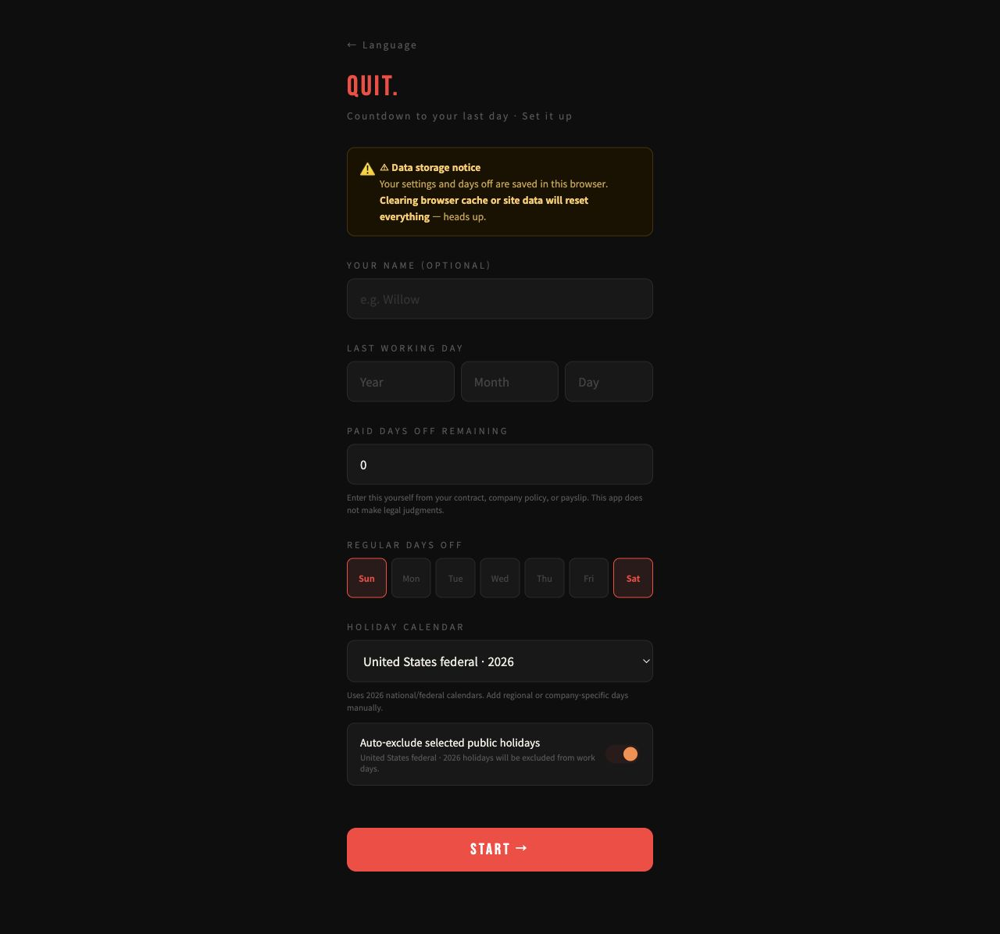
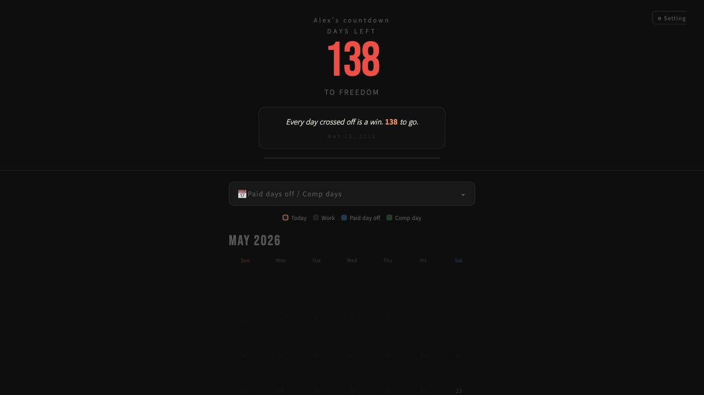

# QUIT.

A quiet countdown app for your last working day.

QUIT. helps you count the workdays left until your final day, with weekends, selected public holidays, and your own paid days off reflected in the total.

[Live app](https://willow-baek.github.io/quit-countdown/)

## Screenshots

| Setup | Countdown |
| --- | --- |
|  |  |

## Features

- Multilingual interface: Korean, English, Japanese, and Spanish
- Separate holiday calendar setting from language
- 2026 public holiday calendars for Korea, Japan, United States, Canada, Mexico, and Spain
- User-entered paid days off remaining
- Manual paid day off and comp day marking on the calendar
- Offline-ready PWA support
- Browser-local storage, with no account required

## Privacy Note

Your settings are saved in the browser on your device. Clearing browser cache or site data will reset the app.

## Run Locally

Open `index.html` directly, or run a small static server:

```bash
python3 -m http.server 4173
```

Then open `http://localhost:4173`.
